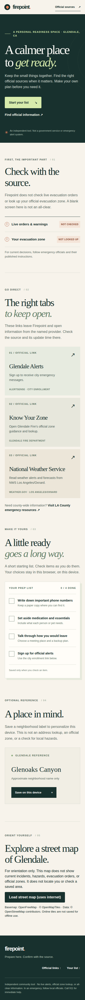

# Firepoint

Firepoint is a planned, account-optional mobile web app for emergency awareness and personal preparedness in Glendale, California. Nearby Southern California coverage is a future possibility **only where source coverage and rights have been checked**. A resident should be able to choose an area, find clearly attributed hazard information and links to agency notices, and keep a personal preparation checklist. The area-specific, source-backed parts of this plan are **proposed, not shipped**; see the current status below.

**Live-source release gate:** NWS, fire/air and Glendale GIS adapters exist, but the production source panel and POST queries are paused pending rights, caching, rate limits and monitoring. The local-only `FIREPOINT_DEMO_LIVE_SOURCES=enabled` switch is for developer integration tests, not a public coverage claim. The map and official agency links are separate.

**Not an official City of Glendale service.** Firepoint does not issue evacuation orders, determine whether a place is safe, or provide an all-clear. For an emergency, follow the responsible public agency and local emergency services. Do not rely on this app as your only source of information.

## App preview


<details><summary>View the mobile preview</summary>



</details>

[The preview workflow](.github/workflows/preview.yml) captures the **static page** on pull requests and refreshes these images after `main` pushes (or a manual workflow run), if GitHub Actions has permission to write to `main`. It deliberately does not load map tiles, query live notices, or display private location data. The interactive map can be opened in the running app while online.

## What exists now

This repository began as a Next.js 16 starter and is under active development. The current UI has outbound links to named official sources, a short checklist saved only after an item is checked, and an optional Glenoaks Canyon neighborhood label saved on this device. Neither the label nor the checklist is an official lookup. A click-to-load OpenFreeMap/OpenStreetMap street map gives general Glendale orientation **only while online**; it has no incident or zone overlay and does not locate the visitor. A "What public sources report right now" panel queries two server routes **only when the visitor asks**, for central Glendale or a one-time, rounded device location: `POST /api/v1/notices/query` (NWS weather alerts, needs a real `NWS_USER_AGENT` contact) and `POST /api/v1/context/query` (CAL FIRE incident points, NIFC/WFIGS mapped perimeters, and AirNow air quality when `AIRNOW_API_KEY` is set), plus `POST /api/v1/hazards/query` (Glendale GIS MCP mapped hazard zones from a dated snapshot, when the event's `GLENDALE_GIS_MCP_KEY` is set). Each source shows its own checked/unavailable/not-set-up status; an empty or failed source is never presented as an all-clear. Neither route ingests city evacuation orders or establishes operational coverage. Hazard lookup, verified evacuation-zone lookup, public reporting, accounts, and an operational backend are not shipped. A service worker supplies a separate offline checklist page, but it does not cache the main app page, official notices, API responses, or maps. An offline map and live offline status are not shipped.

## Run locally

Use Node.js and npm compatible with the checked-in `package-lock.json`:

```bash
npm ci
cp .env.example .env.local  # optional; add a real contact to NWS_USER_AGENT for the server-only NWS route
npm run dev
```

Open <http://localhost:3000>. The local page is development software, not a deployed emergency service. Before a change is ready for review, run:

```bash
npm run lint
npm run typecheck
npm test
npm run build
# or: make check
```

The `Makefile` also has `make gis-fetch`/`make gis-local` developer-only MCP steps. GitHub Actions runs these four web checks for PRs and `main` pushes, with no secret-dependent source calls. Report the result of each command separately. Lint, typecheck, tests, and build do not establish agency source coverage or operational readiness.

## Plan and working agreements

- [Team start](docs/team-start.md): setup, small-change workflow, review gates, and proposed feature boundaries.
- [Source policy](docs/source-policy.md): source trust, coverage, freshness, location privacy, offline behavior, and reports.
- [Data contracts](docs/contracts.md): proposed and implemented schemas; check its status notes before claiming a route or UI integration exists.
- [Map decisions](docs/maps.md): online basemap attribution and limits.
- [Resident stories](docs/user-stories.md), [four-person scope](docs/hackathon-roles.md), and [source/storage roadmap](docs/source-roadmap.md): proposals and ownership boundaries, not shipped services.
- [Product vision](docs/vision.md) and [broader API roadmap](docs/roadmap.md): teammate proposals for later phases. Check their assumptions against the source policy and current status before promising a live feature.

Implemented source integrations are NWS point alerts, CAL FIRE incidents, NIFC/WFIGS current perimeters and AirNow observations, all request-time with no durable cache or polling. NWS is inactive without a real identifying contact and AirNow without a key. None of them is an evacuation feed. Other documents describe future work. Before showing a source in the app, verify its publisher, jurisdiction, update behavior, access terms, and geographic coverage. Never substitute a map view, neighborhood name, or empty feed response for an evacuation status.
