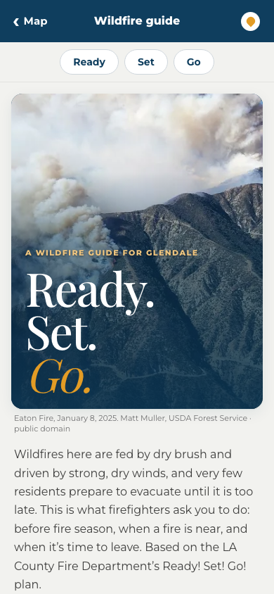
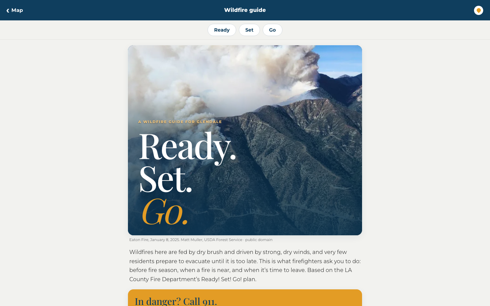

# Firepoint

**Wildfire preparedness and evacuation guidance for Glendale, California.**

Firepoint is a mobile-first web app that helps residents get ready for a wildfire and find a way out when one starts. Mark a fire on the map, and Firepoint finds a road route to the nearest shelter that stays clear of it, plus the fastest escape route out of the danger zone, with turn-by-turn directions. A built-in guide walks through Ready, Set, Go in English, Spanish and Armenian.

Built by a team of four at **Jewel City Hacks 5.0** in Glendale (September 2026), and still in active development.

> **Firepoint is a prototype, not an official emergency service.** Shelter data is unverified and routes aren't checked against real fires or road closures. In an emergency, call 911 and follow Glendale Fire, LA County and [Alert LA County](https://ready.lacounty.gov/emergency-notifications/). See [project status](docs/status.md) for exactly what is real and what is demo data.

**Live demo:** <https://firepoint-sooty.vercel.app>

| Phone | Desktop |
| --- | --- |
|  |  |

## Features

- **Evacuation map.** A full-screen Mapbox map of Glendale in light and dark themes.
- **Fire-aware routing.** Drag a flame onto the map and get:
  - 🏠 the nearest shelter by road, on a route that stays at least 500 m clear of the fire
  - 🚗 the fastest escape route out of the 1-mile danger zone, avoiding mapped high-hazard hills
- **Turn-by-turn navigation** in the app, re-routing if you leave the planned route.
- **Privacy by default.** Location is requested only when you tap, positions are never stored, and fire marks stay in your browser.
- **Wildfire guide** at `/prepare`, adapted from LA County Fire's [Ready! Set! Go!](https://fire.lacounty.gov/rsg/) plan, with links to official Glendale sources.
- **English, Spanish and Eastern Armenian**, reflecting Glendale's communities.
- **Installable PWA** with an offline fallback guide for when the network is down.

## Coming next

- Live hazard data on the map: adapters for NWS alerts, CAL FIRE incidents, NIFC fire perimeters, AirNow air quality and the City of Glendale GIS are already built and tested
- Verified shelters and official evacuation zones
- Real-time notifications
- Community fire reports with moderation
- Voice read-aloud for seniors and kids (ElevenLabs)

See the [product vision](docs/vision.md) and [roadmap](docs/roadmap.md).

## Tech stack

Next.js 16 · React 19 · TypeScript · Tailwind CSS 4 · Mapbox GL JS (maps, Directions, Geocoding) · Zod · Vitest · GitHub Actions · Vercel

## Run locally

Requires Node.js and npm.

```bash
npm ci
cp .env.example .env.local   # add a public Mapbox token (pk.…) as NEXT_PUBLIC_MAPBOX_TOKEN
npm run dev
```

Open <http://localhost:3000>. Without a Mapbox token the app still runs, with straight-line directions instead of a map. Location needs HTTPS or `localhost`.

Before opening a PR, run `make check` (lint, typecheck, tests and build). CI runs the same checks.

## Documentation

| Doc | What's in it |
| --- | --- |
| [Project status](docs/status.md) | What works, what's demo data, what's needed before launch |
| [Architecture](docs/architecture.md) | Routing algorithms, location handling, offline, module map, how to swap providers |
| [Source policy](docs/source-policy.md) | Rules for trusting, showing and caching data sources |
| [Data contracts](docs/contracts.md) | API and data schemas |
| [Maps](docs/maps.md) | Mapbox decisions, attribution, cost and privacy |
| [Translations](docs/translations.md) | How the three languages are handled |
| [Deployment](docs/deploy.md) | Vercel setup and environment variables |
| [Team workflow](docs/team-start.md) | How we branch, review and merge |

## Team

- Gregory Sinaga
- David Domingo
- Aram Abramian
- David Aydenjian

## License

[MIT](LICENSE)

## Disclaimer

Firepoint does not issue evacuation orders, decide whether a place is safe, or give an all-clear. Always follow the responsible public agency and local emergency services, and don't rely on this app as your only source of information.
